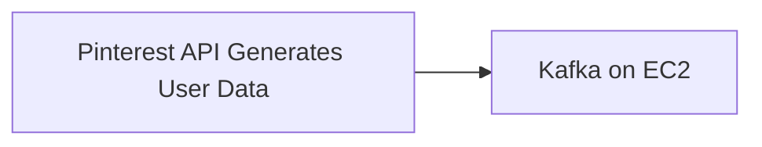

# Pinterest Data Pipeline

## Table of Contents

1. [Project Description](#project-description)
1. [Installation](#installation)
1. [Usage](#usage)
1. [File Structure](#file-structure)
1. [License](#license)

## Project Description

This project aims to process data streams from a Pinterest API emulator.

## Installation

### Required Credentails

1. The AWS RDS credentails for the Pinterest API emulator store in a yaml file (#db_creds.yaml) with the form:

```yaml
HOST:
  <insert host adresse>
USER:
  <insert user name>
PASSWORD:
  <insert RDS password>
DATABASE:
  <insert database name>
PORT:
  <insert port>
```

1. An EC2 private key store in a pem file (Key pair name.pem).

## Usage

## File Structure



## License

MIT License

Copyright (c) [2024] [Chile Mwamba]

Permission is hereby granted, free of charge, to any person obtaining a copy
of this software and associated documentation files (the "Software"), to deal
in the Software without restriction, including without limitation the rights
to use, copy, modify, merge, publish, distribute, sublicense, and/or sell
copies of the Software, and to permit persons to whom the Software is
furnished to do so, subject to the following conditions:

The above copyright notice and this permission notice shall be included in all
copies or substantial portions of the Software.

THE SOFTWARE IS PROVIDED "AS IS", WITHOUT WARRANTY OF ANY KIND, EXPRESS OR
IMPLIED, INCLUDING BUT NOT LIMITED TO THE WARRANTIES OF MERCHANTABILITY,
FITNESS FOR A PARTICULAR PURPOSE AND NONINFRINGEMENT. IN NO EVENT SHALL THE
AUTHORS OR COPYRIGHT HOLDERS BE LIABLE FOR ANY CLAIM, DAMAGES OR OTHER
LIABILITY, WHETHER IN AN ACTION OF CONTRACT, TORT OR OTHERWISE, ARISING FROM,
OUT OF OR IN CONNECTION WITH THE SOFTWARE OR THE USE OR OTHER DEALINGS IN THE
SOFTWARE.