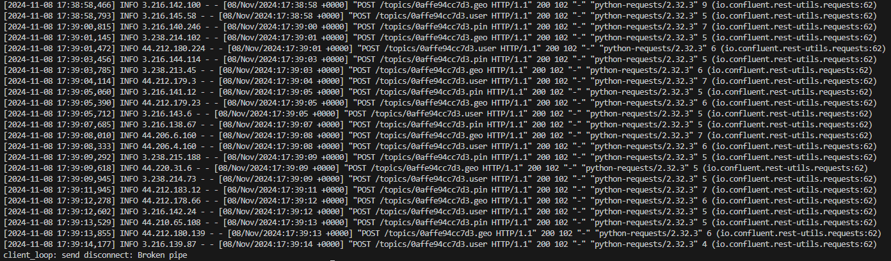

# Pinterest Data Pipeline

## Table of Contents

1. [Project Description](#project-description)
1. [Installation/Setup](#installation)
1. [Usage](#usage)
1. [File Structure](#file-structure)
1. [License](#license)

## Project Description

This project aims to process data streams from a Pinterest API emulator.

Pinterest data retrieved from an AWS database, then sent to a kafka server running on an EC2 instance. From here these topics are stored in an S3 bucket. That S3 bucket is then mounted onto a Databricks Notebook where dataframes are constructed, cleaned and queried.

## Installation/Setup

Clone the repo: [link](https://github.com/ChileMathAcc/pinterest-data-pipeline68.git)

### Main Python file

Install the required python packages found in this text file [requirements.txt](requirements.txt).

### Required Credentails

Ensure the required credentials are in place.

1. The AWS RDS credentails for the Pinterest API emulator stored in a yaml file called "db_creds.yaml" of the following form:

```yaml
HOST:
  <insert host adresse>
USER:
  <insert user name>
PASSWORD:
  <insert RDS password>
DATABASE:
  <insert database name>
PORT:
  <insert port>
```

2. An EC2 private key store in a pem file named "Key pair name.pem".

### EC2 instance

1. Connect to your EC2 instance using the key in the pem file.
1. Setup a Kafka instance with MSK cluster authentication.
1. Create the three topics we will be interested in: Post info topic (pin), Location info topic (geo) and User info topic (user).

### S3 bucket

1. Create an S3 bucket to store the data from the different topics.
1. Create an MSK plugin-connector pair to push information from kafka on EC2 to S3.

### REST API

Create an API that posts data from the python [file](user_posting_emulation.py) to the kafka topics on EC2.

### Databricks

Create a notebook and mount it onto the S3 bucket

## Usage


### Python file

The purpose of this stage is to continously generate data. It should have two terminals open and running:

1. Python: This terminal should present a continous stream of data being posted and the status code of each posting request.


1. SSH Client: This terminal should present the stream of data being recieved on the EC2 instance.



### Databricks Notebook

At this stage we can aggregate, clean and query the data we have recieved.

1. Aggregating: We create dataframes from all the individual entries that have been streamed to the S3 bucket.


1. Clean: Change the schema, the column names, remove duplicates and handle missing data.


1. Queries: Find actionable statistics about the data.


## File Structure

### Main file: user_posting_emulation.py

This python file has one Class AWSDBConnector whose attributes are the credentails (HOST, USER, PASSWORD, DATABASE, PORT) used to connect to an RDS of Pinterest data. This Class has three methods:

- read_db_creds - This takes in a yaml file with the nessecary credentails and returns a dictionary of these credentials.
- post_to_API - This takes Pinterest data and sends it to an EC2 instance using an API.
- create_db_connector - Creates the RDS connection.

## License

MIT License

Copyright (c) [2024] [Chile Mwamba]

Permission is hereby granted, free of charge, to any person obtaining a copy
of this software and associated documentation files (the "Software"), to deal
in the Software without restriction, including without limitation the rights
to use, copy, modify, merge, publish, distribute, sublicense, and/or sell
copies of the Software, and to permit persons to whom the Software is
furnished to do so, subject to the following conditions:

The above copyright notice and this permission notice shall be included in all
copies or substantial portions of the Software.

THE SOFTWARE IS PROVIDED "AS IS", WITHOUT WARRANTY OF ANY KIND, EXPRESS OR
IMPLIED, INCLUDING BUT NOT LIMITED TO THE WARRANTIES OF MERCHANTABILITY,
FITNESS FOR A PARTICULAR PURPOSE AND NONINFRINGEMENT. IN NO EVENT SHALL THE
AUTHORS OR COPYRIGHT HOLDERS BE LIABLE FOR ANY CLAIM, DAMAGES OR OTHER
LIABILITY, WHETHER IN AN ACTION OF CONTRACT, TORT OR OTHERWISE, ARISING FROM,
OUT OF OR IN CONNECTION WITH THE SOFTWARE OR THE USE OR OTHER DEALINGS IN THE
SOFTWARE.